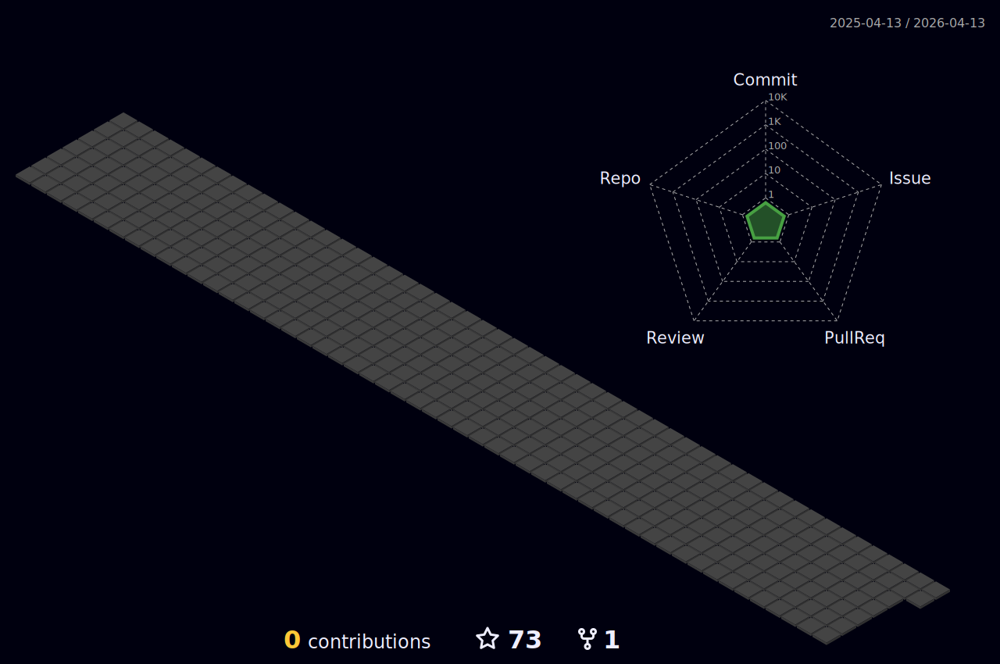

# Hey , I'm [Lakhan!](https://lakhan1122.github.io/links) 

## 🌱 I’m from Gadchiroli, India .
## 🌱 I’m currently learning ...
## **Java, Aspiring Java Developer**

## About Me
 --Observant and detail-oriented aspiring Full-Stack
Web Developer with a specialization in Java
Backend Development. An enthusiastic, hardworking, and self-motivated who is always
looking forward to learning new skills. A complete
team player who is excited to be at the
deployment phase of his new career as a FullStack Web developer.

### 🌱 What do I do?
- ✔️ Though I have completed my Graduation, I aspire to work as a programmer.

- ✔️I'm a fast learner looking for interesting career opportunities as a Java developer. 

### ⚡ One line that describes me best? 
A hard working boy who enjoys good humour & coding.😉😉

### 📫 How can you reach me?

<h2 align="center">Languages and Tools:</h2>
   
  

      
      
      
      
      
      

  
<h2 align="center">📊 My Github Stats<h2>

  
  

   
  

  
  

  
 

  

